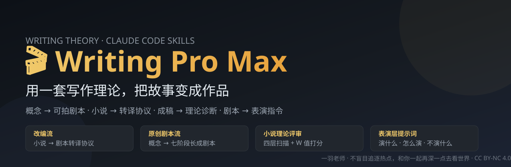

**中文** | [English](README.en.md)

# Novel Skills


[](https://github.com/juemin4-source/novel-skills/discussions)

## 让故事从零件长成命运

AI 可以迅速生成设定、人物、大纲和台词。

可许多故事依然像一堆彼此拼接的零件：人物拥有完整档案，却没有真正被世界逼迫；情节不断发生，却没有改变任何人的命运；结局已经写完，意义也随之耗尽。

Novel Skills 源自原创文学理论《文学天演论》，试图解决一个更根本的问题：

> 一个故事怎样从概念开始，经过人物、命运与现场，最终留下无法被轻易耗尽的余震？

它将《文学天演论》中的人物生成、世界受力、命运周期、十二时位、二十四节气、现场判断与余震理论，编译成四个可以直接调用的 AI 技能。

```text
世界机制
→ 人物受力
→ 命运生长
→ 结构成形
→ 情节进入现场
→ 现场转化为表演
→ 故事结束，意义继续震动
```

这套系统不会用固定节拍替你拼装一个"看起来像故事"的答案。

它会持续追问：

* 人物从世界的哪个受力位置长出来？
* 他的"私、处、执、为、已"是否真的进入了行动？
* 这段情节处在什么时位，现在应该生长、育成、停止，还是清算？
* 抽象情绪是否已经进入身体、物件、空间与关系？
* 某次选择究竟改变了什么，又让谁再也回不到原来的位置？
* 故事结束以后，留下的是续集钩子、作者解释，还是意义未尽的余震？

## 四个技能，一条完整创作链

| Skill | 它解决的问题 | 产出 |
| ----- | ---------- | ---- |
| `novel-original-writing` | 一个概念怎样长成具有世界、人物、命运和余震的剧本？ | 世界模型、人物关系、命运结构、场景与剧本 |
| `novel-review` | 一部小说究竟哪里没有成立？ | 带原文证据的诊断、红黄牌问题与天演评分 |
| `novel-to-screen-adaptation` | 小说中的心理、因果和主题怎样变成屏幕上可见的行动？ | 改编命题、发动机、物件系统、场景卡与可拍剧本 |
| `video-prompt-adapter` | 剧本里的情绪怎样变成 Seedance 2.5 能够执行的表演？ | 角色内在、微表演、镜头关系与 Seedance 2.5 平台提示词 |

## 四种使用入口

### 从一个念头开始

> "我只有一个模糊概念，帮我把它长成故事。"

调用 `novel-original-writing`，从种子、世界、人物、结构、现场一路推进到余震。

### 诊断一部已经写出的作品

> "这部小说读起来不对，但我不知道问题在哪里。"

调用 `novel-review`，从人物、结构、结局和文笔四层寻找文本证据，判断问题究竟来自人物未生成、时位失候、现场缺失，还是结尾没有余震。

### 把小说转化成可拍的剧本

> "保留这部小说真正重要的东西，把它改编成影视剧本。"

调用 `novel-to-screen-adaptation`，保留原作的因果、主题和叙事功能，重新寻找适合屏幕的行动、物件、关系与视听载体。

### 把表演写进视频提示词

> "画面已经对了，但人物仍然像站在镜头前摆拍。"

调用 `video-prompt-adapter`，把角色的内心变化拆成眼神、呼吸、动作节拍、身体关系、镜头位置与否定约束，输出**适配 Seedance 2.5** 的提示词（表演层 + 平台公式/@引用/时间戳参数）。

## 导演模式

所有关键阶段都由用户裁决。

```text
AI 提议
→ 用户选择、修改或拒绝
→ 阶段产出
→ 样片摘要
→ 通过 / 修改 / 自检 / 评审
→ 继续生长
```

AI 可以大胆参与创作，也必须交代判断依据。人物与结构允许在后续现场中被重新发现；阶段签核代表当前版本足以继续推进，不代表故事已经失去变化的权利。

## 理论核心

《文学天演论》关注的始终是同一个过程：

> 文学发生于情节进入现场之后，在人物与读者心中造成的不可逆变化。

人物不能只拥有标签，他必须从世界机制、故事位置以及"私、处、执、为、已"中长出来。

结构不能只排列事件，它必须判断事物正在隐藏、发动、生长、育成、停止、清算，还是归藏。

现场不能只负责描写，它要让抽象进入身体，让读者从"知道发生了什么"走向"亲身经历了什么"。

结尾也不能只负责停止。真正的余震来自前面已经发生的一切：人物无法回去，关系无法复原，旧答案失效，而意义仍未耗尽。

Novel Skills 将这些判断带进每一次真实创作。

---

## 安装

**方式一：插件市场安装（推荐）**

```text
/plugin marketplace add juemin4-source/novel-skills
/plugin install novel-skills@novel-skills
```

**方式二：手动复制**

四个目录平级复制到项目的 `.claude/skills/`（或用户级 `~/.claude/skills/`），保持平级即可——技能间引用为相对路径。

## 作者

**一羽老师** —— 不盲目追逐热点，和你一起再深一点去看世界。

- B 站（写作理论持续更新：二十四节气验收句、私执为已、故事天演论）：https://space.bilibili.com/8913993
- GitHub：https://github.com/juemin4-source

《文学天演论》系列（含《人物篇》《命运篇》《故事天演论》）为作者原创方法论，本仓库是其 Claude Code 操作化实现。

## License

[CC BY-NC 4.0](LICENSE)（署名-非商业性使用）——你可以共享、改编，需署名且不得商用。
